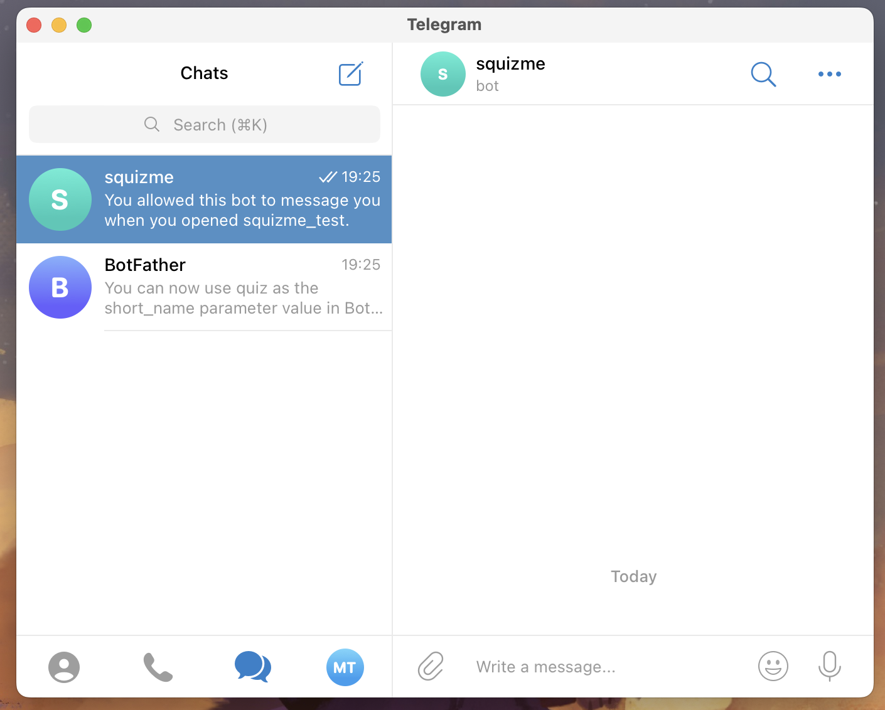

# squizme

## TL;DR;
To locally setup a Mini App on Telegram you will need:
1. A **web server** running on your machine
2. A **localhost exposer** to allow Telegram access your localhost
3. A **Telegram bot** running on your machine

# Creating a Test Env
1. iOS: tap 10 times on the Settings icon > Accounts > Login to another account > Test.
2. After creating the account, on the macOS: click the Settings icon 5 times to open the Debug Menu, ⌘ + click ‘Add Account’ and log in using the Test.

# To setup Mini Apps
GREAT example of mini app: https://github.com/revenkroz/telegram-web-app-bot-example

# To debug Mini Apps
### Install the Telegram Beta Version (macOS)
1. Download and launch the Beta Version of Telegram macOS.
2. Quickly click 5 times on the Settings icon to open the debug menu and enable “Debug Mini Apps”.
Reference: https://core.telegram.org/bots/webapps#debug-mode-for-mini-apps

### Create a Telegram test account
A **test account** allows access to the test envirorment of Telegram. It is completely separate from the main environment where you have you real account. You will need to create a new user account:
```
- iOS: tap 10 times on the Settings icon > Accounts > Login to another account > Test.
- Telegram Desktop: open ☰ Settings > Shift + Alt + Right click ‘Add Account’ and select ‘Test Server’.
- macOS: click the Settings icon 10 times to open the Debug Menu, ⌘ + click ‘Add Account’ and log in via phone number.
```
Reference: https://core.telegram.org/bots/webapps#using-bots-in-the-test-environment

### Create a Telegram Mini App
Talk to `BotFather` and type `/help`. A list of commands will appear. Follow the instructions of `/newapp` to create a new app:
```
Web Apps
/myapps - edit your web apps
/newapp - create a new web app
/listapps - get a list of your web apps
/editapp - edit a web app
/deleteapp - delete an existing web app
```

`BotFather` will ask you: `Now please send me the Web App URL that will be opened when users follow a web app direct link.`
This URL must be a valid URL exposed on the internet. But you will start developing on your localhost, how to setup that? Follow the above.

### Setup the Mini App locally
The following steps will allow that you develop your Mini App on your local server (localhost), and at the same time accessing it on the Telegram App (test environment)

1. Create a web server: 
`python3 -m http.server`
Response:
`Serving HTTP on :: port 8000 (http://[::]:8000/) ...`

2. Expose your localhost. I suggest using [ngrok](https://ngrok.com/docs/getting-started/) to allow your localhost be accessible on the internet, a requirement to run Mini Apps locally.

3. Tell `BotFather` the ngrok URL to finish the Mini App creation.
> Pay attention that every time you run the ngrok it will be a different URL and you will need to run `/editApp` to edit it.


### Implementing the Mini App
By this point you must be able to access the Mini App by its URL, something like `t.me/yourbot_bot/app_name`. You will also notice that the chat with the App is completely empty.  


This is where the implementations starts. Telegram currently supports six different ways of launching Mini Apps: from a keyboard button, from an inline button, from the bot menu button, via inline mode, from a direct link – and even from the attachment menu.  
  
Follow the [documentation](https://core.telegram.org/bots/webapps#implementing-mini-apps) to set it up.

Kuddos to [TheCymond](https://github.com/TheCymond/Telegram_Web_App)